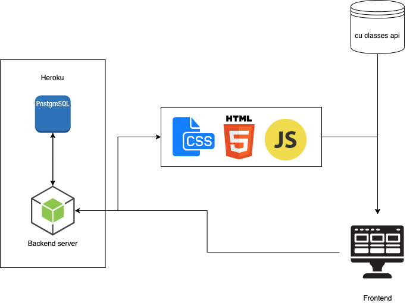

# CU App
[](https://github.com/marketplace/actions/super-linter)


## Description
This application will have many features that students at CU can use to improve their lives. The main feature will be a schedule planner which will allow students to add their classes, clubs, tests, homework, and other activities to their personal schedule. They can also link their calendar to their phone so they can get updates about important events coming up.

The application’s schedule feature will include reminders of to-do’s, ability to add tasks to the calendar, and campus event updates. The application will also allow users to create accounts so they access their personal schedule.

The application will also have map features which will show where their classes are and detailed maps of the buildings around campus.

## Dependencies
- `node`
- `yarn`
- `postgres`

## Running the application
Make sure to first build the frontend code. You will need to run this to run this whenever you change code in `public/js/`.
```bash
yarn build
```

Start a node server for api and webpages.
```bash
yarn start
```
Alternatively, you can use start a development server which will watch for changes. This means that you do not need to manually restart the server after changing code.
```bash
yarn dev
```

## Development
### Including frontend javascript
For frontend code, certain files are used as entry points and compiled into chunks.
Those are listed in `webpack.config.js`.
You can then use those chunks in html files. 
Chunks will be compiled to `/js/[name].bundle.js`. Please include those files to run scripts in your html code.

### Including css
If you want to use a style sheet, include them in the relevent javascript file, rather than the view files.

```javascript
import '../styles/style.css';
```

This is due to how webpack is setup.

### Editing html
Edit the view templates in the `views/` directory to edit html.
Which views correspond to which file is viewable in `webpack.config.js`.

The `home.hbs` file acts as the body of `index.html`.

### yarn
`yarn start` will start the node server.

`yarn lint` will check the formatting for javascript code.

`yarn lint-css` will check the formatting for css files.

`yarn test` will run javascript tests.

## Architecture
Postgresql will be used as the database. The cu class api will be used for getting class information. The backend server will use nodejs and be hosted on heroku. The frontend will be written in html, javascript, and css.


