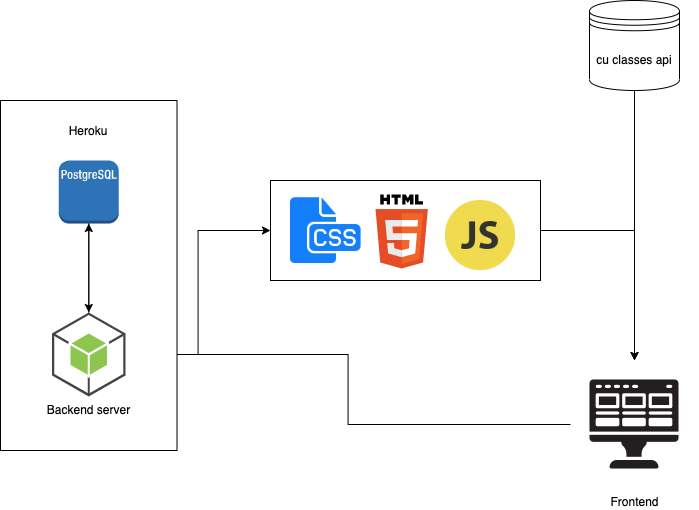

# Description
This application will have many features that students at CU can use to improve their lives. The main feature will be a schedule planner which will allow students to add their classes, clubs, tests, homework, and other activities to their personal schedule. They can also link their calendar to their phone so they can get updates about important events coming up. 

The application’s schedule feature will include reminders of to-do’s, ability to add tasks to the calendar, and campus event updates. The application will also allow users to create accounts so they abscess their personal schedule.

The application will also have map features which will show where their classes are

# Architecture
Uses postgresql as the database. The cu class api will be used for getting class information. The backend server should be written in nodejs and hosted on heroku. The frontend will be written using html, javascript, and css.

